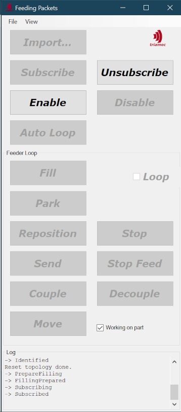

# DirectFeed Sample

The DirectFeed sample enables to process arbitrarily big move profiles for one or several axes.
There are many buttons to demonstrate what's happening under the covers. However, the Auto Loop
button as well as a command line switch allow for automating repeated profile moves.
Additionally, when dragging a move profile file over the application icon, it will automatically be executed.

> [!IMPORTANT]
> Please read and follow the recommendations in this document before first starting the application.

## Configuration
This document presumes Visual Studio as IDE to use with the sample projects. When starting Visual
Studio, one or more security warnings will be shown. In order to work properly, choose “Load project
normally” and acknowledge the dialog.
When first opening the solution, set the `DirectFeedApplication` project as startup project.

Several configurations within the `DirectFeed.sln` must be adjusted to the actual hardware environment to execute the application for.
The starting point is a working TAM configuration for your system. Refer to the Drive Setup User Guide
on how to set up a configuration.
If you didn’t make the configuration persistent on the drive, you’ll need to set up the path to the configuration by starting this application, then going to preferences using menu **File | Preferences…**, and
setting the *TAM configuration* file preference in the *Startup* category appropriately.

> [!NOTE]
> This application works with the default Triamec workspace on the system. That is, changing
preferences as described above may affect other applications as well.

As next step, configure the preferences shown in the *DirectFeed* category.
At least, the *Axes* preference needs your attention. Initially, there are no axes configured. Clicking on
the ellipsis on the right will show a collection editor which allows you to specify the names of the target axes.

The order of the axes is significant in several aspects:

- The order must be according to the data columns.
- If there are mechanical constraints, the order defines the sequence the axes move to their start and park positions. The application moves the axes to the start positions one by one in the order they are defined, and in reverse order back to park position.
  
The `PositionDimensionality` preference affects the amount of data sent to one axis. The application supports the following values:

- 1 – send position (not recommended since firmware doesn't yet derive velocity and acceleration).
- 2 – send position and velocity (not recommended since firmware doesn't yet derive acceleration).
- 3 – send position, velocity, and acceleration.

The imported data must have an according layout.

## Motion Profiles
A simple motion profile, `data.txt`, is shipped as example, look in the `DirectFeedApplication` project.

The motion profile needs to correspond with the `Axis` and `PositionDimensionality` preferences
as introduced above. For each specified axis, `PositionDimensionality` number of
columns need to be specified, in correct order. Columns exceeding that requirement will be ignored.

Beneath the provided sample `data.txt` profile, simple profiles may be created using the scope of the
TAM System Explorer as follows:

- Of the path planner signals, plot position, velocity, and acceleration of each axis with 10kHz while moving.
- Save plots as comma separated value file.
- Modify the first two data rows such that the first data row contains the park position and the second data row the start position. The start position is the first actual row of the motion profile.

## Application Modes
When simply starting the application, a window with plenty of buttons is presented. The left button column sets up DirectFeed top down while the right column is used for tear down bottom up. A history is shown at the bottom of the window. Text printed out in red indicates some warning or error, mostly  due to some unlucky configuration.

The *Auto Loop* button will automatically start the process of repeatedly feeding the motion profile, using the buttons from the *Feeder Loop* group. If you omit the *Auto Loop* button, you may step through the process manually.

### Scripting

There is another mode, comparable to an autopilot, which is activated by passing the name of a motion
profile file to the DirectFeed application. Dragging the motion profile file over the application icon in
Windows Explorer does just this. In this case, the `DirectFeed.Execute` method will be called. This
method demonstrates the use of the different business functionality in correct sequence. The buttons
and history will reflect progress.
> [!WARNING]
> When you intercept the script by pressing a button, this will tear down
the system. For detailed information refer to the  of the application.

The *Repeat* preference determines whether the path will be looped.

## Shortcomings
The application imports all positions as single precision floating point numbers.

As a developer, you may customize the rate the packet feeder feeds packets to the drives using the `PacketFeeder.DownsamplingControl` peripheral register. This application uses the maximal feasible rate as indicated by the `IsochronousBasePeriod` of the first configured station. However, move
profiles might include information about the rate, too (as is the case with the example `data.txt`). The
application currently ignores this information.

Triamec didn’t design this application for use in a production environment.
